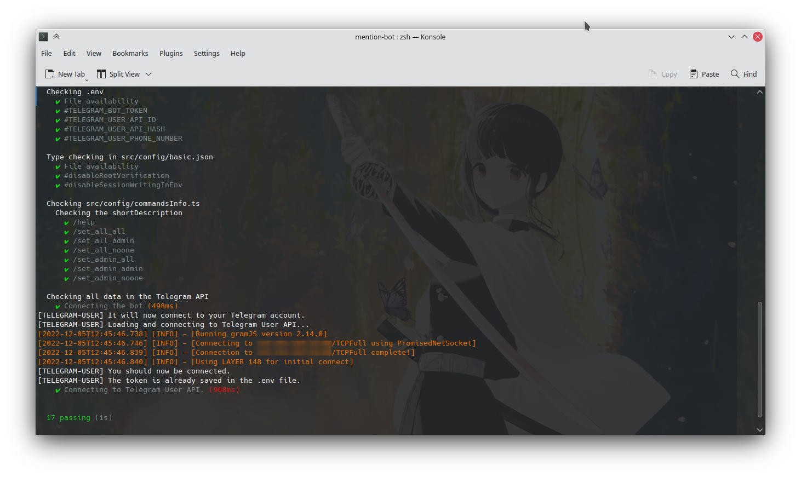
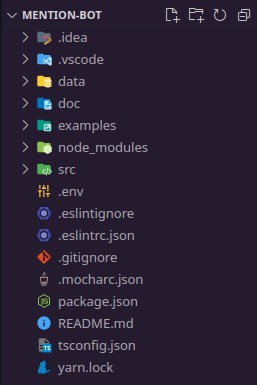
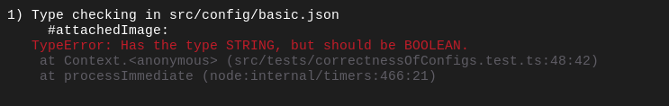

# Testing tools
Okay, you have configured the configs of the bot, but you want to make sure that you did everything right? In this case, some of these commands can help you:

## Tests
To check if everything is correct with your configuration, enter the command: `yarn run configTest`

If successful, you should get something like this:


In general, the tests are divided into several stages:
1. Checking the presence of the .env file and the token in it.
2. Checking [basic.json](../../src/config/basic.json) for errors.
3. Checking [commandsInfo.ts](../../src/config/commandsInfo.ts) in which it is checked that the short description is not empty or does not exceed a certain number of characters.
4. Connecting to Telegram and to your account, checking for a valid token.

We recommend that you do testing every time you change the config!
## Possible errors during testing
### **Error: ENOENT: no such file or directory, access '.env'**
The error indicates that you have not created the file.env in the root directory. Check if it exists and if not, type the command `yarn run initFiles`.


### **Error: Empty token!**
You didn't specify the bot token in the `.env` file. Check that your file looks something like this:
```fix
TELEGRAM_BOT_TOKEN=3829410421:AIO_dhjlskAJKLDJlkd_S9d879S
```

### **Error: Could not read src/config/basic.json file.**
### **SyntaxError: Unexpected token s in JSON at position** ***X***
You have made some mistake in the [basic.json](../../src/config/basic.json) file. Make sure that you follow the syntactic rules of the JSON format, do not put extra commas, do not forget to close quotes.

### **TypeError: Has the type STRING, but should be BOOLEAN.**
It looks like you have set the wrong type for some property. Specifically, in this case, in the screenshot below, we set the string for the "`attachedImage`" property, and we should have boolean (`true`/`false`)


### **Error: In the /cmd command, the length of the shortDescription cannot be zero.**
Check the [commandsInfo.ts](../../src/config/commandsInfo.ts) file, it looks like you forgot to install a short description of the command somewhere.

### **Error: Failed to connect to the bot. You may have incorrectly specified the token in the .env file or you do not have an internet connection.**
Check the internet connection and the validity of the token.

### **Cannot connect to the Telegram account.**
In case the client cannot connect to your account, try deleting the line with `TELEGRAM_USER_SESSION_CODE`.
Also check that all data is up to date.

----
> Back to [README.md](../../README.md)