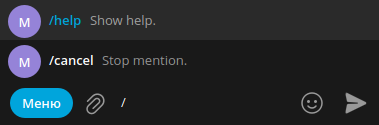

# Гайд по настройке basic.json 
Чтобы начать, откройте файл [basic.json](../../src/config/basic.json), находящийся в директории [src/config/](../../src/config/)
Если этого файла не существует, то пропишите команду `yarn run initFiles`

## Справка по параметрам
- `disableRootVerification` - Свойство, которое отключает проверку запуска бота из корневого каталога. Рекомендуется не прикасаться к этому свойству.
- `disableSessionWritingInEnv` - По умолчанию клиент записывает данные вашей сессии в .env файл, чтобы в следующий раз не просить у вас вести пароль и код. При значении `true` бот при каждой перезагрузке будет запрашивать у вас код для входа в аккаунт.

# Настройка отображения команд
Перейдите в файл [src/config/commandsInfo.ts](../../src/config/commandsInfo.ts). Чуть ниже вы увидите вот такую схему команд:
```ts
help: {
  show: true,
  shortDescription: 'Show help.'
},
set_all_all: {
  show: false,
  shortDescription: 'Allow all members to be mentioned via @all.'
}
```
- `help`, `set_all_all` - названия команд.
- Параметр `show` отвечает за отображение команды в Telegram. Если значение равно `false` - команда не будет предложена пользователю.
- Параметр `shortDescription` отвечает за краткое описание команды, который пользователь видит при её написании. **Пожалуйста, не оставляйте эту строку пустой!!**



---
> Вернутся к [README.md](./README.md)